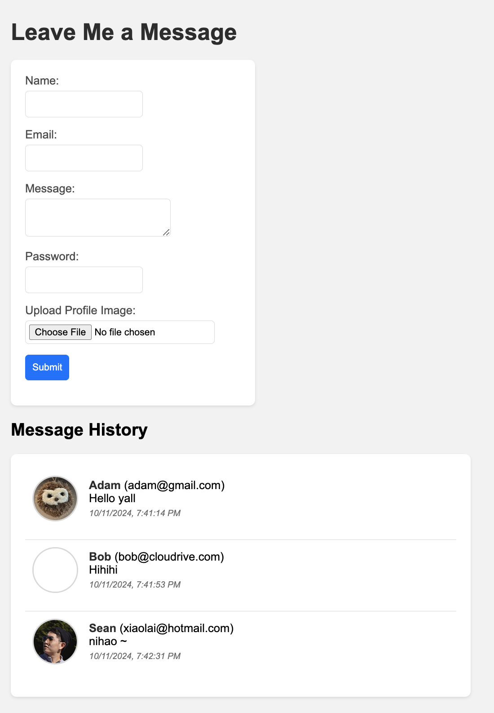
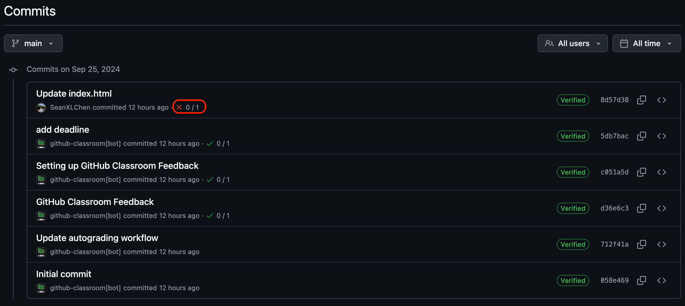
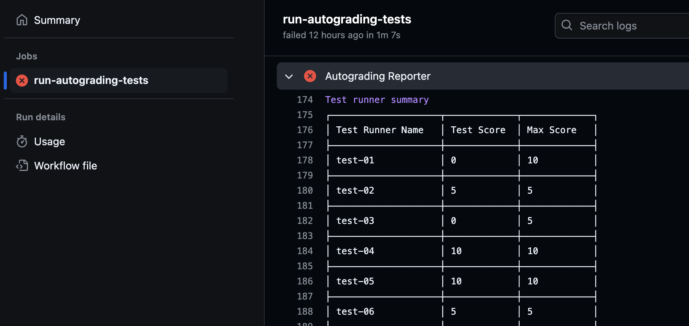

# Assignment 2: Advanced JavaScript and UI Features

In this assignment, you will enhance your personal portfolio by adding advanced JavaScript functionalities. You are expected to add features such as a theme switcher, dynamic date/time display, and a contact form with submission handling. The following rubric will guide you in implementing these features.

---

## Project Structure:
You must continue working within the `src` folder of your portfolio website from **Assignment 1**. Make sure you organize your files as follows:

```
src/ 
├── index.html # Your main landing page 
├── message.html # Your leave message page
├── css/ 
│ └── style.css # Your main CSS file, external styles should go here 
├── scripts/ # JavaScript files should be placed in this folder 
│ └── index.js # Your Feature 1 & 2 JavaScript file
│ └── message.js # Your Feature 3 JavaScript file
└── images/ # Store your images here (optional)
```

---

- **Do Not Modify Files Outside the `src` Folder:**
    - Any changes to files outside the `src` folder may result in failed tests or disqualification of your submission.

---

## Rubrics & Requirements

##### Total Points 100

### JS Feature 1: Theme Switcher (35 pts)

#### Toggle Button or Switch for Theme (10 pts):
- Add a button or switch to the top right of the page that allows users to toggle between **dark** and **light** themes.
- Requirements:
  - home page must have a toggle element with the id: `theme-toggle`.

#### Change of Font and Background Color (10 pts):
- When the theme is toggled, at least **one font color** and **one background color** should change.
- Requirements:
  - The `<body>` element must have two CSS classes named `light-theme` and `dark-theme` that can be toggled by the button.
  - The `light-theme` class should be applied by default when the page is loaded.
  - Toggling the theme toggle element must add/remove these classes from the <body> to switch between themes.

#### Dynamic Button or Switch Label/Text (10 pts):
- The text on the toggle element should dynamically update to reflect the current theme.
    - If the theme is light, the toggle element text should display "Dark Mode".
    - If the theme is dark, the toggle element text should display "Light Mode".
- Requirements:
  - The button must have the id: `theme-toggle`, and the text content must change based on the current theme.

#### Class-based Design Separation (5 pts):
- The CSS for dark and light themes should be separated using class toggles. **Do not hard-code styles in JavaScript**; instead, use CSS classes to handle the design changes.
- Requirements:
  - CSS rules for light-theme and dark-theme should be defined in the src/css/style.css file.


---
### JS Feature 2: Date/Time Display (20 pts)

#### Initial Date/Time Setup (7 pts):
- Add a section to index page that displays the current **date** and **time** when the page loads.
  - The page should display the current date and time when it loads.
  - The date must be displayed inside an element with the `id="current-date"`.
  - The time must be displayed inside an element with the `id="current-time"`.
  - The date must follow the format `Mon Feb 07 2022` (3-letter abbreviation for weekday and month).
  - The time must follow the format `8:10:56 PM` (12-hour clock with seconds).

#### Dynamic Time Update (13 pts):
- Use JavaScript to **update the time every second** dynamically, without refreshing the page.
- The displayed time inside the element with `id="current-time"` should update every second to reflect the current time.
- The time update should occur dynamically without requiring a page reload.
- The time format should remain consistent as `8:10:56 PM` (12-hour clock).
- The time should transition smoothly from one second to the next without any visible delay or flicker.

---

### JS Feature 3: Contact Form Submission (45 pts)

#### Form Creation (10 pts):
- Create a new page `message.html` that use scripts `message.js`, inside this page create a **Leave Message** form that includes the following fields:
    - **Name** (text input, `id="name"`, required)
    - **Email** (email input, `id="email"`, required)
    - **Message** (text area, `id="message"`, required)
    - **Password** (password input, `id=passsword`, required)
      - The password field should display the input as `***` (obscured characters).
    - **Upload Profile Image** (file input, optional):
      - Accepts only `PNG` or `JPG` formats.
      - Image size should not exceed 2MB.

#### Form Submission and Dynamic Display (35 pts):
- **Validation (10 pts):**
    - Ensure that the form is validated:
        - All fields (Name, Email, and Message) except image should not be empty.
        - Email should be in a valid format.
- **Mock Submission and Dynamic Display (25 pts):**
    - On form submission, after successful validation:
        - Dynamically display the submitted message in a **message history** section on the same page.
        - Each submission should be added as a `<div>` with `class=message`
        - Each `<div>` with `class=message` should display:
            - User’s Name
            - Email
            - Message content
            - Uploaded image (*displayed alongside the User's Name, styled as an oval shape, if no image uploaded, show a empty white image instead*).
            - Timestamp of submission
        - Clear the form fields automatically after submission.
    - Sample implementation
        


### Automated Testing

Your project will be automatically tested against the rubric using a set of predefined tests. These tests will check the structure and content of your HTML and CSS files, so ensure your project strictly follows the guidelines provided. :warning: :warning: :warning: Any modification to files outside the `src` folder could result in failed tests or disqualification of your submission. :warning: :warning: :warning:

#### Viewing Your Autograder Score

To access the results of the autograder for your commits, follow these steps:

1. After pushing your changes to GitHub, click on the commit message to view the details of the specific commit.
   
2. On the commit details page, find the Actions status and click on it to view the results of the autograder task.
   
3. Review the detailed report of your autograded score. This report will show which tests passed or failed, and how many points were awarded based on the rubric.
   